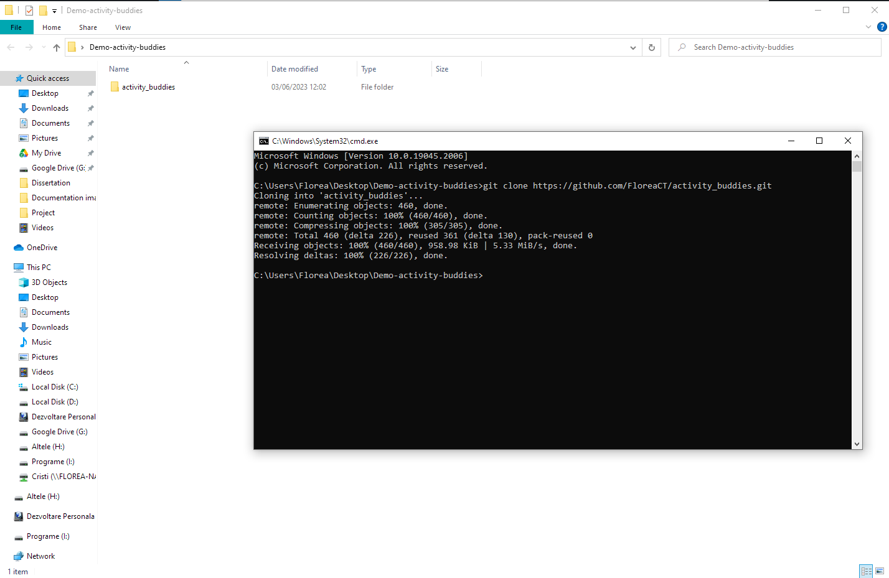

# Welcome to Activity Buddies

Student: 10148467
Live: [Live application](https://activity-buddies.web.app "Activity Buddies")

Activity Buddies is a single-page app that helps students stay active by connecting them with others with similar interests and activities. The app allows users to create profiles, search for other users with similar interests, and create or join events based on their interests. Overall, Activity Buddies is an excellent tool for students looking to stay active and connect with others who share their passions.

## Table of Contents

[Installation](#installation)
[Usage](#usage)
[Features](#features)
[Contributing](#contributing)
[License](#license)

## Installation

There are two ways of installing the projects:

### 1. First method:

Download and extract the repository and save it wherever you want on your computer.

### [How to download the repository!](public/documentation/download.png "How to download the repository")

  
    Then you need to open VS code and add drag and drop the folder you've just extracted to it

### [How to add folder](public/documentation/drag_and_drop.png "How to add folder to VS code!")

In the VS terminal you will need to write in the exact order:

- <code>git init</code>
- <code>npm install</code>
- <code>npm run dev</code>

The server should be now up and running on port 3030. You should be able to access the website using the following link [localhost:4000](http://localhost:4000/)

### 2. Second method:

Create a folder anywhere on your computer. Open a terminal and navigate to that folder.

After that use the following command in order to clone the repository:

- <code> git clone https://github.com/FloreaCT/activity_buddies.git </code>

You should have a new folder created like the one showed bellow

Open the folder with VS Code and write the following the terminal:

- <code>npm install</code>
- <code>npm run dev</code>

Congratulations!

## Usage

### 1. Login

You will need to either log in using Google or create an account and log in using the chosen email and password.

[How to login!](public/documentation/login.png "How to login")

### 2. Edit your profile

After you log in, you will be presented with the profile page. If this is the first time you logged in after creating the account, you will need to edit your profile so your details are up to date, and the algorithm can use your "Interest" to give you relevant activities.

[How to edit your profile!](public/documentation/edit_profile.png "How to edit your profile")

### 3. Activity search

Once you click the Activities page, you can filter the activities by interest/tags, date or location. From here you can see the details about the activities, as well as how many people will attend each activity. On this page you have the possibility to create your own activity and also check which activities you are currently attending.

[Activity page!](public/documentation/activities.png "Activity page")

### 4. Buddies

The Buddies page lets you add and delete buddies

[Buddies page!](public/documentation/buddies.png "Buddies page")

### 5. Messages

Students can chat in real-time with each other. They can search for a buddy in the chat panel only if the user is added as a friend.

[Messages page!](public/documentation/chat.png "Messages page")

## Features

1. Authentication: The app uses Firebase Authentication to allow users to sign up, log in, and log out.

2. Real-time chat: The app uses Cloud Firestore to store and retrieve chat messages in real-time.

3. Activity create, search and filter: Students can create, search and filter for an activity of their interest.

## Contributing

If you would like to contribute to this project, please follow these steps:

1. Fork the repository to your own GitHub account.
2. Create a new branch for your changes.
3. Make your changes and commit them to your branch.
4. Push your changes to your fork.
5. Submit a pull request to the original repository.

Here are some tips for submitting a successful pull request:

- Make sure your changes are well-documented and include clear descriptions of the changes and any relevant issues or documentation.
- Include screenshots or videos if your changes include visual changes.
- Ensure your changes are tested thoroughly and do not introduce new bugs or issues.
- Follow the coding standards and guidelines of the project.
- Wait for feedback or approval from me before merging your changes.

## Questions

If you have any questions or need help, you can reach out to me at [1florc83@solent.ac.uk](mailto:1florc83@solent.ac.uk).

## Technologies Used

**React**: A JavaScript library for building user interfaces.

**Vite**: A build tool that aims to provide a faster and more efficient development experience for modern web applications.

**Firebase**: A cloud-based platform for building web and mobile applications.

**Tailwind CSS**: A utility-first CSS framework for building responsive and customizable web pages.

**Flowbite**: A library of interactive components for building web interfaces built on top of Tailwind.

**React Router**: A library for handling client-side routing in a React application.

**Firebase Authentication**: A library for authentication in a Firebase application.

**Cloud Firestore**: A NoSQL document database that allows for real-time synchronization of data.

**Cloud Functions for Firebase**: A serverless platform for building backend services in a Firebase application.

**react-icons**: A library for adding icons to React components.

**react-toastify**: A library for displaying notifications in a React application.

**react-modal**: A library for creating modals in a React application.

## Status

**_In development_**

## License

This project is licensed under the [MIT License](https://opensource.org/licenses/MIT).
